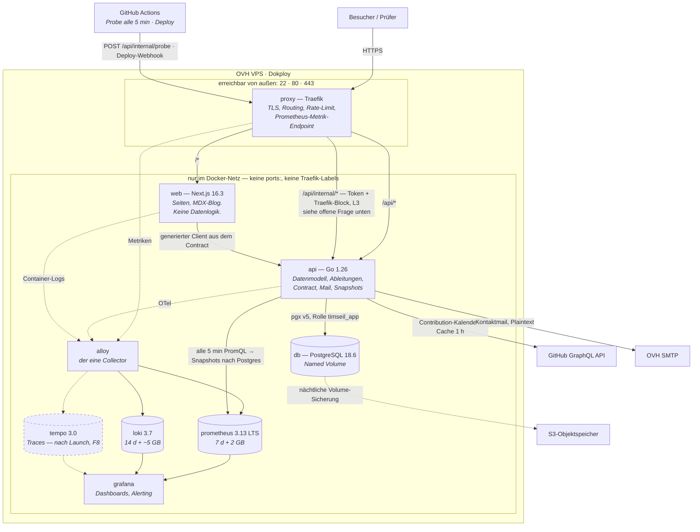

# C4 Level 2 — Container

**Leser:** wer wissen will, was auf dem Host läuft, wer mit wem spricht und
**was von außen erreichbar ist**. Für den Blick von außen siehe
[Kontext-Diagramm](c4-context.md).

**Ein Host zum Launch** — acht Container in einem Dokploy-Stack (ADR 0008).
Ein zweiter Host kommt erst, wenn ein zweites Projekt ihn mitträgt.

Gestrichelte Kanten sind der **Messweg**, durchgezogene der Anfrageweg.
`tempo` ist gestrichelt, weil es **nach dem Launch** kommt (F8) — genau wie die
Faro-Frontend-Telemetrie (F11), die kein eigener Dienst ist, sondern über
`faro.receiver` in `alloy` läuft. Ein Diagramm, das beide solid zeichnet,
behauptet einen Betrieb, den es am Launch-Tag nicht gibt.

## Die Container

| Container | Sprache · Basis | Verantwortung | Von außen |
|---|---|---|---|
| **proxy** | Traefik, von Dokploy | TLS, Routing, Rate-Limit, Metrik-Endpoint | **ja** — 80, 443 |
| **web** | Next.js 16.3, `node:24-alpine`, non-root | Seiten, Rendering, MDX-Blog. Keine Datenlogik | nein |
| **api** | Go 1.26, `distroless/static:nonroot`, read-only rootfs | Postgres, Ableitungen, Contract, Validierung, Mail, Snapshots | nein |
| **db** | PostgreSQL 18.6 | Systeme, Tracks, Belege, Vorfälle, Deploys, Snapshots | **nie** |
| **alloy** | Grafana Alloy | scrapt Traefik, API und Node, tailt Container-Logs, empfängt OTLP und Faro | **nie** |
| **prometheus** | 3.13 LTS | Metriken, 7 d **und** 2 GB | **nie** |
| **loki** | 3.7 | Logs, 14 d **und** Größen-Limit ~5 GB | **nie** |
| **grafana** | aktuell | Dashboards, Alerting | Entscheidung in L3 |

Startreihenfolge (D2): `db` (`pg_isready`) → `migrate` als Init-Container
(Rolle `timseil_migrate`, DDL) → `api` (Healthcheck) → `web`.
**Alle persistenten Daten als Docker Named Volumes** — Dokploys
S3-Volume-Backups funktionieren nur damit.

## Die Vertrauensgrenze

**Von außen erreichbar sind 22, 80 und 443. Sonst nichts.**

- **Keine Traefik-Labels und keine `ports:`** für `prometheus`, `loki`, `alloy`,
  `db` — nur `expose:` im Docker-Netz. Prometheus kann über seine Admin-API
  Zeitreihen löschen, Loki liefert sämtliche Logs. Solange diese Dienste hinter
  einem WireGuard-Tunnel lagen, war fehlende Authentifizierung egal; **mit der
  Zusammenlegung auf einen Host ist dieser Schutz weggefallen** und wird hier
  ersetzt.
- **Die Dokploy-Oberfläche ist nicht öffentlich.** Sie hat vollen Zugriff auf
  Host, Deploys und **alle Env-Variablen — also auf sämtliche Secrets**. Zugang
  nur über SSH-Tunnel (`ssh -L 3000:localhost:3000`), kein Traefik-Router, Port
  in der Firewall zu.
- **Grafana** ist der Grenzfall (L3): entweder derselbe Tunnel, oder öffentlich
  mit `GF_USERS_ALLOW_SIGN_UP=false`, starkem Passwort bzw. GitHub-OAuth,
  `cookie_secure` und ohne Anonymous-Zugriff.
- **`/api/internal/*`** ist token-authentifiziert **und zusätzlich am Traefik
  geblockt** — zwei Schichten, und es steht nicht in `/api/docs`.

### Offene Frage — beim Zeichnen aufgefallen

**M3 verlangt, dass `/api/internal/*` von außen `404` liefert. F4 lässt den
GitHub-Actions-Probe genau dort anklopfen — von außen.** Beides zugleich geht
nicht: entweder der Pfad ist am Traefik dicht, dann erreicht ihn der Probe nicht,
oder er ist offen, dann trägt nur noch das Token.

Auflösungen, die infrage kommen — **entschieden wird das in L3, nicht hier**:
eine IP-Allowlist für GitHubs Runner-Bereiche (die sich ändern und per Meta-API
gepflegt werden müssten), ein eigener Pfad für den Probe außerhalb von
`/api/internal/*`, oder der Probe misst nur von außen und meldet über den
Datenbranch statt über einen Endpoint. Steht als Fundstück im `backlog.md`.

**Abnahme in M3:** `nmap` von außen zeigt ausschließlich 22, 80, 443.
Dieses Diagramm ist die Vorlage für das Threat Model (STRIDE über die Container),
das **vor** L2 entsteht — davor gebaut steuert es die Härtung, danach
dokumentiert es nur, was ohnehin passiert ist.

## Das Risiko, das dieser Schnitt erzeugt

`loki`, `prometheus` und `db` liegen auf **derselben Platte**. Ein durchgedrehter
Log-Producer kann die Datenbank lahmlegen — ein selbstgebauter Ausfall, und der
wahrscheinlichste. Deshalb sind die Limits in der Tabelle oben keine Empfehlung:
**Zeit-Retention allein reicht nicht**, eine Fehlerschleife füllt in Stunden
Gigabytes und die 14-Tage-Regel greift erst in 14 Tagen. Dazu Disk-Alert ab 70 %.

## Belege

Build-Plan Kapitel 4.1–4.3, Kapitel 10, Kapitel 11.1–11.4 ·
ADR 0005, 0007, 0008 · Phasen D1, D2, F2, L3, M3 ·
Form angelehnt an `docs/design/Case Study Map` (MAP.03 Schichtenbild).
Die **Fakten** des Blattes — SQLite, Postgres 16, Health-Container,
Access-Log-Parsing — sind überholt; es gelten ADR 0005 und ADR 0007.
