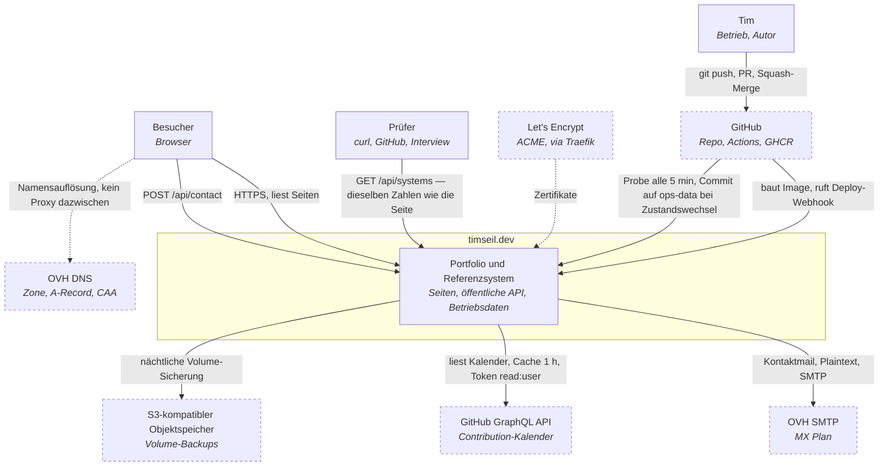

# C4 Level 1 — Kontext

**Leser:** wer wissen will, wer mit dieser Seite spricht und welche fremden
Dienste im Spiel sind. Für den Blick *in* das System siehe
[Container-Diagramm](c4-container.md).

Handgezeichnet, nicht generiert: ein Diagramm aus dem Code zeigt Struktur, dieses
hier zeigt **Absicht** (Build-Plan Kapitel 12.1).

## Herkunft — als Wort, nicht als Farbe

| Beteiligter | Herkunft | Rolle |
|---|---|---|
| Besucher | außen | Liest Seiten, schickt höchstens eine Kontaktnachricht |
| **Prüfer** | außen | Ruft die API direkt auf. **Er ist der Grund, warum es die Seite gibt** — ADR 0004 |
| Tim | eigen | Schreibt, deployt, betreibt |
| OVH DNS · SMTP · VPS | extern | Registrar, Zone, Postfach, Host — **eine** Partei, nicht vier |
| Let's Encrypt | extern | Zertifikate, von Traefik erneuert |
| GitHub | extern | Code, CI, Registry — **und der Beobachter von außen** (ADR 0008) |
| GitHub GraphQL API | extern | Contribution-Kalender. REST liefert ihn nicht |
| S3-Objektspeicher | extern | Volume-Backups mit Versionierung und Object-Lock |

**Was hier nicht steht, ist die Aussage:** kein CDN, kein WAF, kein Analytics,
kein Tracker, kein CMS, kein Session Replay. Zwischen Browser und Server steht
niemand — ADR 0006, und die Legal-Seite zeigt es dem Besucher live.

## Drei Wege durch die Karte

**Ein Besucher ruft die Seite auf**
DNS → Traefik → TLS → Next.js → API → Postgres → Antwort. Traefik zählt die
Anfrage als Metrik, nicht als Logzeile, die jemand später parst (ADR 0007).

**Tim ändert etwas**
`git push` → PR → CI grün → Squash-Merge → Actions baut das Image → GHCR →
Deploy-Webhook → Dokploy zieht das Image → Healthcheck → live, sonst läuft die
vorige Version weiter.

**Etwas fällt aus**
Der GitHub-Actions-Probe merkt es **von außen** — ein Server kann seinen eigenen
Ausfall nicht melden. Bei Zustandswechsel ein Commit auf `ops-data`. Kommt der
Host zurück, füllt die API `ops_checks` rückwirkend auf, und der Ausfall
erscheint als **Kerbe im Betriebsraster**, nicht als Lücke. Ohne Post-Mortem
keine Kerbe (Invariante 4).

## Belege

Build-Plan Kapitel 4.1–4.6, Kapitel 11.1 · ADR 0004, 0006, 0007, 0008 ·
Form angelehnt an `docs/design/Case Study Map` (MAP.02, „Drei Wege durch die
Karte"). Die **Fakten** des Blattes sind älter als dieser Plan und gelten nicht.
